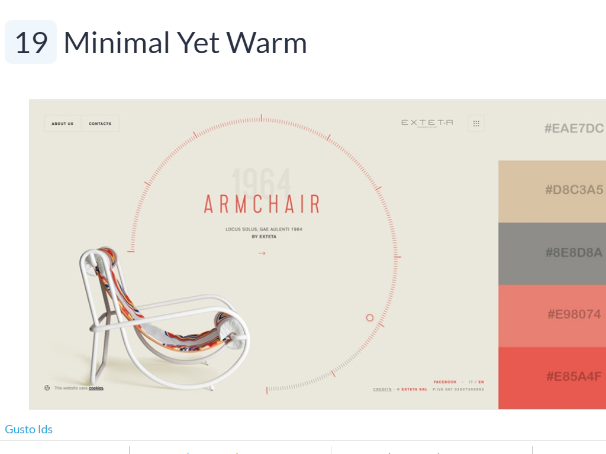

# Portfolio
[Deployed Portfolio](https://cmfuertes.github.io/Portfolio/)

## User Story

Initially this portfolio was to have multiple pages. However, after browsing through many portfolios, I felt the single page was much cleaner, more my style and much simpler to use. 

### Inspiration
I was inspired by [Pavel Huza](http://www.pavelhuza.com/)'s porfolio, and went with a much simpler version that matched my skillset. 

I deleted the other pages, and stuck with using only the index.html. Here I created four seperate sections, an intro, an about me, my portfolio, and a contact section.

To add a fun element to my page, upon visiting the site, my name in the header has an animation that will only loop once, otherwise page needs to be refreshed to see it. Animation was provided by [Tobias Ahlin](https://tobiasahlin.com/moving-letters/#9). A js file was created for the sole purpose of running this animation. 

After browsing for a proffesional color scheme, I came upon "Minimal Yet Warm" from [Visme](https://visme.co/blog/website-color-schemes/). A seperate stylesheet was made to accomodate color changes from using bootstrap. 

I created a logo for myself for "Cristhal Fuertes Designs" with use of [Tailor Brands](https://www.tailorbrands.com/). I put my new logo in my navbar, above my intro, as well as adding an icon to the webpage title tab. 

### Portfolio Updates
Navbar was created, linking each menu item to the corresponding sections. About me was updated from previous portfolio. Screenshots, as well as links were added to the portfolio displaying completed projects. Images were given an opacity styling unless hovered over. This was done to subdue the striking contrast of the color of the projects compared to color scheme of my page. Each project has a description as well as the link to the deployed repo page. 

Contact section has had a drastic upgrade from previous portfolio. All buttons work. Upon clicking the email link, users will find the subject line already filled in with my an email set to be sent to me. Phone number will open in cell phone keypads. A link to my updated resume as a pdf has been added.  Link to gitHub has also been added, along with links to LinkedIn. 

### Profile Updates

My linked in has now been updated along with a professional photo, as well as a new thorough personal statement. Github profile has also been updated with an profile picture, short bio, as well as pinned repositories. I started following other classmates as well. 

09/29/2020 Update - Projects and newer homework assignments have been added to portfolio section of page. Github profile updated with pins spotlighting group projects and newer homework assignments.

12/8/2020 - More projects have been added. Animations have been incorporated into the page. Introduction has been updated, and a new resume has been added. 

### Conclusion 

My internet proffesional prescence has drastically been updated due to this homework assignment. My long neglected LinkedIn looks tidy, and my portfolio has a more polished appearance as opposed to my first one. Portfolio is mobile-first ready with working buttons. 

## Links
1. [Updated Portfolio](https://cmfuertes.github.io/Portfolio/)
2. [GitHub Profile](https://github.com/CMFuertes)
3. [Updated Resume](https://cmfuertes.github.io/Portfolio/assets/CristhalResume.pdf)
4. [Updated LinkedIn](https://www.linkedin.com/in/cristhal-fuertes-8507244a/)
5. [GitHub Repo](https://github.com/CMFuertes/Portfolio/)
